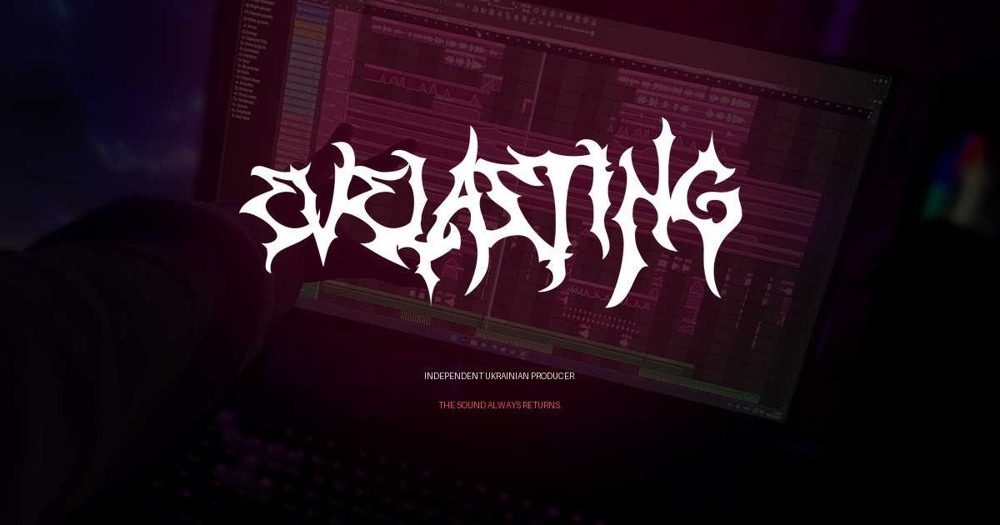

# Evelasting

Official website of **Evelasting**, an independent Ukrainian phonk producer from Kryvyi Rih.

[Visit the website](https://evelasting.com) · [YouTube](https://www.youtube.com/@evelasting) · [Spotify](https://open.spotify.com/artist/3nTuhNtsxzV6yakWQ5rwvX) · [SoundCloud](https://soundcloud.com/evelasting1) · [Apple Music](https://music.apple.com/ua/artist/evelasting/1634217010)



## About

Evelasting is an immersive artist website built around music, atmosphere, and story. It brings official releases, the artist's creative journey, and listening links together in one bilingual experience.

The project represents the return and evolution of Evelasting's sound across phonk, chill phonk, drift phonk, and ambient phonk.

## Highlights

- Interactive music experience powered by the SoundCloud catalog
- Individual pages for official releases
- English and Ukrainian interface
- Responsive cinematic design and motion
- Live YouTube and artist statistics with safe fallbacks
- SEO metadata, structured data, sitemap, and social previews
- Privacy-aware analytics and installable web app support
- Accessibility and reduced-motion considerations

## Built with

- [Next.js 16](https://nextjs.org/)
- [React 19](https://react.dev/)
- [TypeScript](https://www.typescriptlang.org/)
- [Tailwind CSS 4](https://tailwindcss.com/)
- [Motion](https://motion.dev/)
- SoundCloud Widget API and YouTube Data API

## Run locally

Requirements: Node.js and npm.

```bash
git clone https://github.com/Denys-Zaitsev/evelasting.git
cd evelasting
npm install
cp .env.example .env.local
npm run dev
```

Open [http://localhost:3000](http://localhost:3000).

The site works without API credentials by using fallback values. To enable live YouTube statistics, add your own server-side key to `.env.local`:

```env
YOUTUBE_API_KEY=your_key_here
```

Never commit `.env.local` or any real API key. Local environment files are excluded by `.gitignore`.

## Available commands

```bash
npm run dev     # Start the development server
npm run build   # Create a production build
npm run start   # Run the production build
npm run lint    # Check the codebase
```

## Project status

Evelasting is actively developed. New releases, visuals, and refinements are added as the artist's story continues.

## Copyright

Copyright © 2026 Evelasting. All rights reserved.

The source code, music, artwork, photography, video, branding, and other project assets may not be copied, redistributed, or reused without permission.
